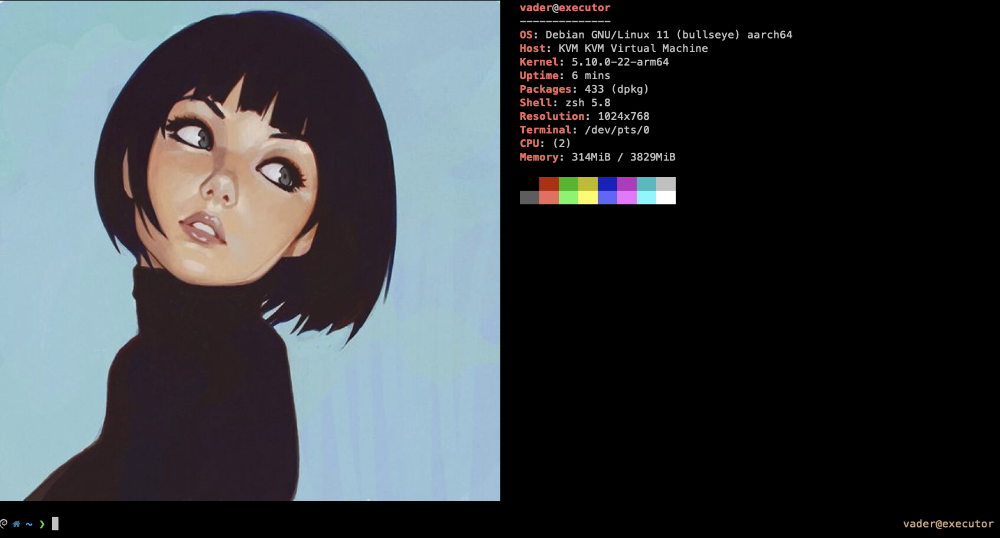

## oh-my-zsh + powerlevel10k + neofetch with cloud-init




To use, add following to cloudinit user-data file:

```yaml
#include
https://raw.githubusercontent.com/oregonpillow/powerlevel10k/master/cloud-init.yml
```

## Requirements
- [iTerm2](https://iterm2.com/) (needed for image rendering)
  ```
  If image renders too small in iTerm2, try disabling retina resolution rendering:
  iTerm2 settings > Advanced > search 'show inline images at Retina resolution' --> set to 'no'
  ```
- .zshrc on client should include defined locals (for mosh to work):
  ```bash
  export LC_ALL=en_US.UTF-8
  export LANG=en_US.UTF-8
  export LANGUAGE=en_US.UTF-8
  ```

### Tested

|OS            |Tested|
|--------------|------|
| Debian 11    |   ✓  |
| Debian 12    |   x  |
| Ubuntu 22.04 |   ✓  |


